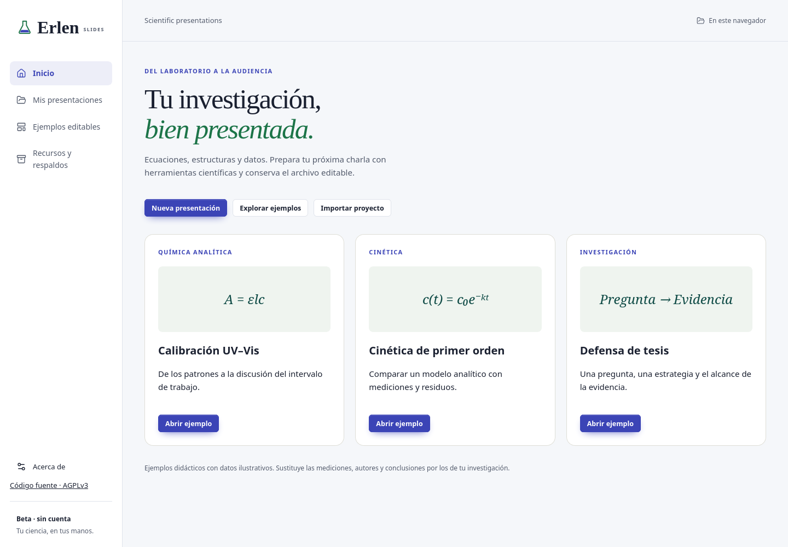
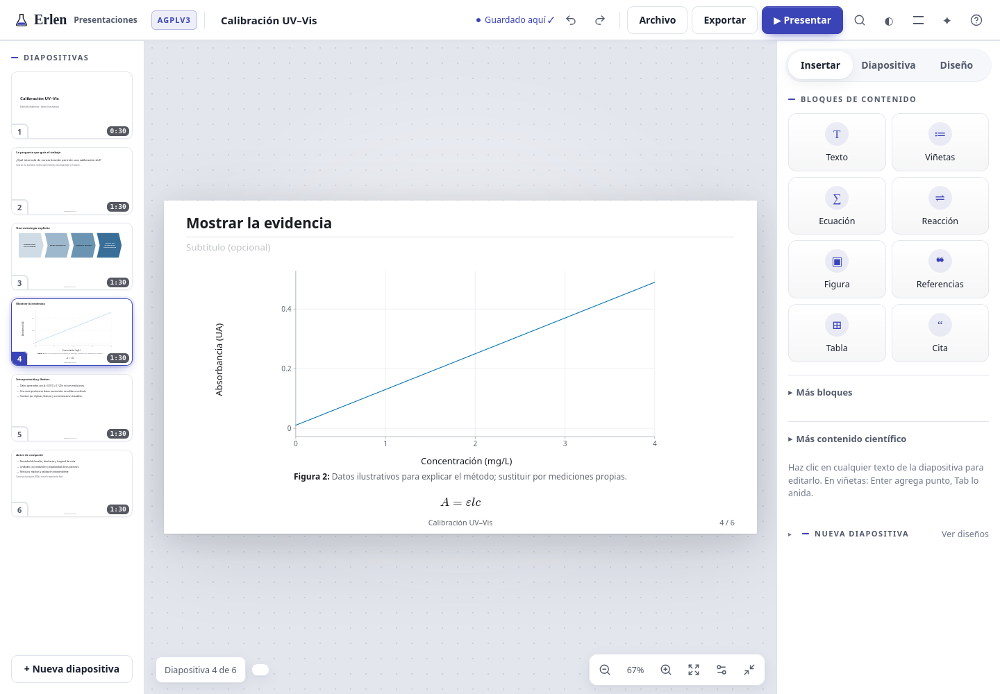
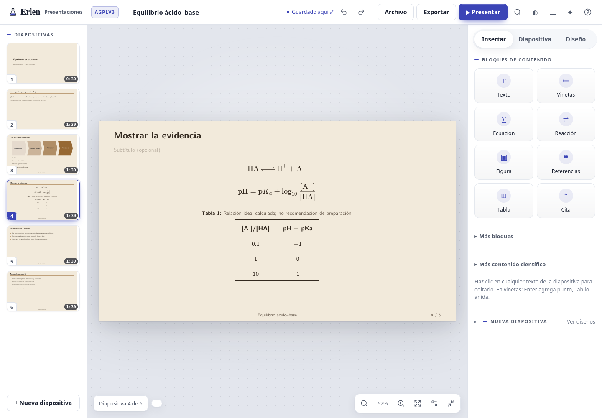

# Erlen Slides: Scientific presentations

**Presentaciones científicas libres, editables y hechas en tu navegador.**

Escribe ecuaciones, dibuja química, explica datos y prepara tu próxima charla. Erlen Slides reúne edición por bloques, herramientas científicas y modo de presentación en una aplicación local, sin cuenta ni suscripción.

**Versión 0.2.1 · beta · AGPLv3.** Publicación independiente del módulo Presentaciones de Erlen. Interfaz en español.



[Empezar](#empezar) · [Ejemplos editables](examples/README.md) · [Cómo es la interfaz](docs/interfaz.md) · [Manual](docs/uso.md) · [English](docs/README.en.md) · [Citar](CITATION.cff)

## Del resultado a la diapositiva



- **Comunicación científica:** ecuaciones LaTeX, reacciones, estructuras químicas, tablas, gráficas con datos editables —con barras de error y ejes logarítmicos—, diagramas y montajes de laboratorio.
- **Preparación:** notas del orador, tiempos, revisión del contenido, orden de diapositivas y modos de ensayo/presentación.
- **Archivos propios:** biblioteca local, proyecto JSON, plantillas personales, identidad institucional y copias de recuperación.
- **Exportaciones:** PDF mediante impresión, PowerPoint, fuente Beamer y HTML imprimible. Cada formato tiene [límites documentados](docs/uso.md#exportaciones).
- **Herramientas libres:** KaTeX, RDKit, Kekule.js, 3Dmol.js y Plotly. Los componentes científicos adicionales se cargan desde los archivos de la propia aplicación.

El asistente integrado localiza herramientas mediante reglas; **no es un modelo generativo de IA**. Esta publicación no incorpora cuentas, cobro, sincronización en la nube ni coedición simultánea.

## Empezar

Descarga el paquete `erlen-slides-0.2.1-web.zip` desde [Releases](https://github.com/jorgegonzalezsevilla/erlen-slides/releases). Incluye la aplicación ya construida:

1. Descomprime el ZIP.
2. Para el editor básico, abre `erlen-slides-offline.html`.
3. Para usar también RDKit, Kekule, 3Dmol y Plotly, sirve la carpeta con un servidor estático local; por ejemplo, si tienes Python:

```sh
python3 -m http.server 8130 --bind 127.0.0.1
```

Abre `http://127.0.0.1:8130`. Una vez descargado el paquete, este servidor local no requiere contratar un servicio.

Desde el código fuente, necesitas Node.js 22 o superior y npm:

```sh
git clone https://github.com/jorgegonzalezsevilla/erlen-slides.git
cd erlen-slides
npm ci
npm run build
npm test
npm start
```

El servidor escucha únicamente en `127.0.0.1:8130`. La instalación inicial descarga dependencias; después la edición y el cálculo local pueden funcionar sin Internet. Las consultas voluntarias a Crossref o Zotero Web sí necesitan conexión.

## Doce ejemplos completos

Cada ejemplo contiene **seis diapositivas**, notas, archivo JSON editable, fuente Beamer y una guía de adaptación. Son casos de trabajo científico con **datos explícitamente ilustrativos**, no experimentos realizados ni publicaciones inventadas.

| Caso de uso | Qué puedes practicar |
|---|---|
| [Calibración UV–Vis](examples/calibracion/) | Patrones, unidades e intervalo de trabajo |
| [Cinética](examples/cinetica/) | Modelo, datos y límites de interpretación |
| [Defensa de tesis](examples/defensa/) | Pregunta, comparación y contribución |
| [Reunión de laboratorio](examples/reunion-laboratorio/) | Avances, controles y siguiente decisión |
| [Journal club](examples/journal-club/) | Lectura crítica de un artículo real |
| [Equilibrio ácido–base](examples/equilibrio-quimico/) | Reacciones, ecuaciones y aproximaciones |
| [Espectroscopia](examples/espectroscopia/) | Señal sintética y preprocesamiento |
| [Análisis reproducible](examples/reproducibilidad/) | Código, datos y entorno |
| [Diseño experimental](examples/diseno-experimental/) | Unidad experimental y controles |
| [Congreso](examples/congreso/) | Una figura y un mensaje central |
| [Derivación](examples/derivacion/) | Pasos matemáticos e hipótesis |
| [Datos abiertos](examples/datos-abiertos/) | Archivos, diccionario y cita |



## Guardado y privacidad

El autoguardado usa el almacenamiento de **este navegador y este origen web**. Borrar los datos del sitio, cambiar de navegador o moverlo a otra dirección no traslada tu biblioteca. Descarga proyectos JSON y respaldos ZIP. El historial de recuperación local no sustituye una copia externa.

Erlen Slides usa claves de almacenamiento propias. Para traer una presentación de Erlen, expórtala como JSON e impórtala aquí; no lee automáticamente sus bibliotecas. No contiene configuración de producción, telemetría automática ni claves de servicios.

## Desarrollo y validación

Lee [Arquitectura](docs/desarrollo.md), [Validación](docs/validacion.md) y [Contribuciones](CONTRIBUTING.md). Las capturas proceden de Firefox; las pruebas de integración con JSDOM simulan geometría y no sustituyen la inspección visual. Las exportaciones deben revisarse antes de enviar un trabajo científico.

## Licencia y cita

El código original, documentación y ejemplos de este repositorio se publican bajo **GNU Affero General Public License v3.0 únicamente**: [LICENSE](LICENSE), identificador `AGPL-3.0-only`. Los componentes de terceros conservan sus licencias y atribuciones: [THIRD_PARTY_NOTICES.md](THIRD_PARTY_NOTICES.md).

La interfaz contiene un enlace visible al código fuente. Si modificas y despliegas esta aplicación, conserva el acceso al código fuente correspondiente de tu versión y revisa los términos de la licencia.

[CITATION.cff](CITATION.cff) y [.zenodo.json](.zenodo.json) describen la versión. El depósito de Zenodo se documentará con su DOI **cuando esté confirmado**; no hay un DOI provisional inventado. [Proceso de publicación](docs/publicacion.md).
